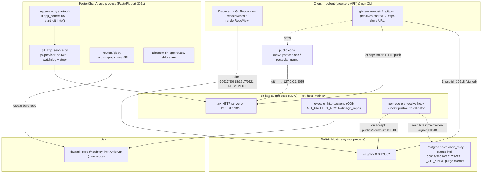

# Git-over-Nostr Host (GRASP) — Design Doc

Status: **design spike** (not implemented). Author: agent design pass, 2026-07-25.
Target repo: PosterChanAI. This doc is written to be implemented from directly and code-reviewed.

## 1. Goal & scope

Move PosterChan's **own** git hosting off Gitea (`git.poster.place`) onto a **native,
fully self-contained git-over-nostr host** that:

- Depends on **nothing external** — no ngit-relay, no `ngit.dev`, no `gitnostr.com`. It uses
  `git` (already installed — `git 2.54.0`, `git-http-backend` at
  `/usr/libexec/git-core/git-http-backend`), PosterChan's **own built-in Nostr relay**
  (`ws://127.0.0.1:3052`, Postgres `posterchan_relay`), and local disk / Blossom.
- Runs the git smart-HTTP server as a **managed, watchdog-respawned subprocess**, spawned only on
  the port-3051 instance — mirroring exactly how the built-in Nostr relay is supervised
  (`app/services/nostr_relay/thread.py`).
- Speaks **GRASP** (Git Repositories Authorized via Signed-Nostr Proofs) + **NIP-34** so the
  existing `ngit`/`git-remote-nostr` clients and PosterChan's own client interoperate.
- Surfaces inside the client's existing **Discover → Git Repos** view (`static/js/client/app.js`
  `renderRepos`), extended from announcement-listing to a real host (browse files/commits/issues/
  patches, "host a repo here").
- **Eventually** hosts the `posterchanai` repo itself and replaces Gitea in `sync.sh`. That
  migration is the **last, riskiest** step and MUST run in parallel with Gitea until proven.

Non-goals for v1: replacing GitHub mirror; multi-tenant quotas UI; web-based merge; CI.

## 2. Background — GRASP + NIP-34 in one screen

GRASP inverts hosting: **Nostr events are the authority; the git server is a dumb, replaceable
data relay.** A GRASP host is two services behind one origin: a **smart-HTTP git server** and a
**Nostr relay**. Repos are addressed at `/<npub>/<identifier>.git`. **There is no HTTP
username/password** — a `git push` is accepted only if it matches a maintainer-**signed** Nostr
event. PosterChan already has the relay half; this project adds the git-server half and the
authorization glue.

NIP-34 event kinds (the ones we handle):

| Kind | Meaning | Notes |
|---|---|---|
| **30617** | Repository announcement | addressable (`d`=repo-id). Owner + `maintainers` tag define the write-ACL. |
| **30618** | Repository **state** (refs) | addressable. `["refs/heads/<b>","<sha>"]`, `["refs/tags/<t>","<sha>"]`, `["HEAD","ref: refs/heads/<b>"]`. **This is the push-authorization token.** |
| **1617** | Patch | `content` = `git format-patch` output; `a`-tags the repo. |
| **1621** | Issue | markdown thread; `a`-tags the repo; `subject` tag. |
| **1622** | Comment / reply | NIP-22 comment on issue/patch. |
| **1623** | (repo-scoped reply — present in relay `_GIT_KINDS`) | kept from purge. |
| **1630/1631/1632/1633** | Status: Open / Applied-Merged-Resolved / Closed / Draft | authored by author **or a maintainer**; latest by `created_at` wins. |
| 1618 / 1619 | Pull-request / PR-update | branch-based PRs; **v2 scope** (see §11). |
| 10317 | User's preferred GRASP-servers list (`g` tags) | client convenience; optional. |

Announcement (30617) tags we use: `["d",id]`, `["name",…]`, `["description",…]`,
`["clone","https://…/<npub>/<id>.git", …]` (multi), `["web","https://…", …]` (multi),
`["relays","wss://…", …]` (multi), `["maintainers","<pubkey>", …]`,
`["r","<earliest-unique-commit-id>","euc"]` (dedup/fork key), `["t","<hashtag>"]`, `["alt",…]`.

A host is identified from an announcement when a `clone` tag looks like
`[http|https]://<grasp-host>/<valid-npub>/<string>.git` **and** a `relays` tag points at the
same host's `wss://`.

`nostr://` clone URL forms: `nostr://<naddr>`, `nostr://<npub|nip05>/<id>`, or
`nostr://<npub>/<relay-hint>/<id>` (relay-hint + id percent-encoded). `git-remote-nostr`
(shipped by `ngit`) resolves these: it reads the 30617 from the relays, extracts the `clone`
`https://` URLs, and runs an **ordinary smart-HTTP** clone against our git server. **Our git
server never parses `nostr://`** — the client does. We only serve plain smart-HTTP + validate
pushes against Nostr.

## 3. Architecture



Key placement decisions:

- The git-http subprocess binds **`127.0.0.1:3053`** (new setting `git_server_port`, default
  3053), never public directly. Public reach is via the existing nginx edge (a `location /git/`
  → `proxy_pass http://127.0.0.1:3053;`), exactly like the relay is exposed at `wss://poster.place/relay`.
- The **pre-receive hook talks to Postgres `posterchan_relay` directly** (synchronous psycopg2
  read of the latest 30618) — not over the websocket. This is the same DB the relay writes, so the
  hook sees committed events with no IPC race. (Alternative: a localhost `REQ` to `ws://127.0.0.1:3052`
  — rejected: async, slower, needs a WS client inside a git hook.)
- **Bare repos live on local disk** under `data/git_repos/` (already exists on the box). Blossom
  is **optional** pack storage for v2 (§6), not the primary store — smart-HTTP wants a real bare
  repo on disk for `upload-pack`/`receive-pack` to operate on.

## 4. Storage layout & bounding

```
data/git_repos/                         # GIT_PROJECT_ROOT (already present on server1)
  <owner_pubkey_hex>/                    # 64-char hex of the repo owner npub
    <repo-id>.git/                       # bare repo; <repo-id> == 30617 d-tag (slug)
      hooks/pre-receive                  # symlink → shared validator (see §5)
      hooks/post-receive                 # symlink → shared 30618-publisher
      config                             # http.receivepack=true, gc.auto, receive.denyNonFastForwards=false
      git-daemon-export-ok               # present ⇒ served (or use GIT_HTTP_EXPORT_ALL)
      grasp.json                         # {owner, repo_id, announcement_addr, created_at}
```

- **Path mapping:** URL `/<npub>/<id>.git/...` → decode npub → hex → `data/git_repos/<hex>/<id>.git`.
  `<id>` is sanitized to `[a-z0-9._-]` (reject `..`, `/`, absolute). Reject non-existent repos with
  404 (do **not** auto-create on GET).
- **Auto-provision on announce:** a bare repo is created lazily when (a) the owner clicks "host a
  repo here" (router `POST /api/git/host`), or (b) the relay ingests a 30617 whose `clone` tag names
  **this** host (a small reconcile step in the git supervisor, mirroring GRASP "auto-create blank
  repos on repository-announcement events"). Creation = `git init --bare` + install hook symlinks +
  write `grasp.json` + set `http.receivepack=true`.
- **Bounding storage** (important — this box also runs LLM/image/music/video):
  - Per-repo hard cap `git_server_repo_max_mb` (default 512). Enforced in the pre-receive hook by
    checking `du` of the quarantine + existing objects; reject the push over cap.
  - Global cap `git_server_total_gb` (default 20). A daily reaper (piggyback on the existing
    blossom-cleanup scheduler pattern) runs `git gc --auto`/`git repack -ad` on active repos and
    logs when total exceeds cap.
  - `git config gc.auto` + `receive.autogc` keep loose objects bounded automatically after pushes.
  - Only **allowlisted owners** may provision (v1: admins + a `git_server_allowlist` npub list,
    default admins-only) — this is the primary abuse bound, matching `node_exec` gating.

## 5. The git-http subprocess (mirrors the relay supervisor)

Two new files, structured exactly like `relay_main.py` + `nostr_relay/thread.py`.

### 5.1 Child entry point — `git_host_main.py` (repo root)

A dependency-light HTTP server (Python stdlib `http.server` with a threaded pool, or `aiohttp` if
we want async — stdlib is enough and adds no dep). It handles only the three smart-HTTP routes and
execs `git http-backend` as CGI:

```python
# routes it accepts (everything else → 404):
#   GET  /<npub>/<id>.git/info/refs?service=git-upload-pack|git-receive-pack
#   POST /<npub>/<id>.git/git-upload-pack
#   POST /<npub>/<id>.git/git-receive-pack
#
# For a matched route it sets the CGI env and execs git-http-backend, streaming stdin→stdout:
env = {
  "GIT_PROJECT_ROOT": os.path.join(REPO_ROOT, "data", "git_repos"),
  "GIT_HTTP_EXPORT_ALL": "1",          # we gate provisioning ourselves; every hosted repo is exportable
  "PATH_INFO": "/<owner_hex>/<id>.git/<service>",  # after npub→hex rewrite + sanitize
  "REQUEST_METHOD": method,
  "QUERY_STRING": qs,
  "CONTENT_TYPE": headers.get("content-type",""),
  "CONTENT_LENGTH": headers.get("content-length",""),
  "REMOTE_ADDR": client_ip,
  "GIT_PROTOCOL": headers.get("git-protocol",""),   # enables protocol v2
  # NIP-98 auth (if present) passed to the hook for the admin/sync.sh path (§6.3):
  "GRASP_NIP98": headers.get("authorization",""),
}
# receivepack is enabled per-repo in config; http-backend quarantines pushed objects and only
# migrates them if pre-receive exits 0 — so an unauthorized push writes nothing permanent.
```

Notes proven from `git-http-backend(1)`:
- `git http-backend` quarantines received objects during `receive-pack`; **if `pre-receive` exits
  non-zero the objects are discarded** — this is what makes "no HTTP auth" safe.
- v2 protocol works by forwarding the `Git-Protocol` header into `GIT_PROTOCOL`.
- Binds `127.0.0.1:<git_server_port>` (default **3053**). Inherits stdout/stderr → journal (like
  `relay_main.py`).

### 5.2 Supervisor — `app/services/git_http_service.py` (copy `nostr_relay/thread.py`)

Replicate the relay supervisor verbatim in shape:

- Singleton holding `proc: subprocess.Popen | None`, `threading.RLock`, `_shutdown` flag,
  `_monitor_thread`, and the crash-loop limiter (`_RESPAWN_WINDOW=600`, `_RESPAWN_MAX=5`,
  `_respawn_times`).
- `_spawn(cfg)`: `subprocess.Popen([sys.executable, os.path.join(REPO_ROOT,"git_host_main.py")], cwd=REPO_ROOT)`.
- `_monitor_loop()`: daemon thread, `time.sleep(15)`, respawn under lock when `proc.poll() is not
  None` and `enabled`, with the same "≥5 crashes / 600s ⇒ back off, log loudly, stop respawning".
- `start_git_http()` (idempotent; lazily starts the one watchdog thread), `stop_git_http()`
  (set `_shutdown=True` first, `terminate()`, `wait(timeout=4)`, then `kill()` — short wait to beat
  systemd's 10s stop deadline), `restart_git_http()`, `git_http_status()` (from `proc.poll()` and a
  `data/git_http.status.json` sidecar).
- If the child must wait for the relay, defer behind a `_relay_ready()`-style TCP probe of
  `127.0.0.1:3052` (do **not** `sleep`).

### 5.3 Wiring into `app/main.py`

- In `startup()` **inside** `if app_port == 3051:` (after the relay start at ~line 440), add
  `start_git_http()` in its own `try/except` that only logs. It must start **after** the relay
  (the hook reads relay data) — relay start at ~440, git host after the stream services (~456).
- In `shutdown()` inside the matching `if app_port == 3051:` guard (~line 715), add
  `stop_git_http()`.
- Never outside the guard (unlike tor). Non-3051 workers must not spawn a second git server.

## 6. Push authorization — the crux (GRASP)

**Principle: the git server accepts a ref update only if the resulting ref→SHA mapping is backed by
a Nostr `30618` "repository state" event signed by an authorized maintainer of that repo.** The
signed 30618 *is* the push authorization token. No passwords, no per-connection auth.

### 6.1 Who is a maintainer (the write-ACL)

- The **owner** = the `<npub>` in the URL path (`/<npub>/<id>.git`). The canonical 30617 is the
  owner's addressable event `30617:<owner_pubkey>:<id>`.
- **Maintainers** = owner ∪ pubkeys listed in the owner's 30617 `["maintainers", …]` tag. Only the
  owner can change this set (30617 is replaceable, keyed by owner pubkey — a non-owner cannot
  overwrite it). This closes the "attacker rewrites maintainers" hole: an attacker's 30617 is a
  *different* addressable event (`30617:<attacker>:<id>`) and is ignored for this repo.

### 6.2 The push flow (GRASP-native, ngit-compatible)

Order matters and matches ngit's proven flow ("state events are no longer broadcast before git
data is successfully pushed" → client publishes state to the host relay's *purgatory* first, then
pushes, then broadcasts):

1. Maintainer's client computes the intended new refs and **signs a `30618`** state event
   (`refs/heads/<b> = <newsha>`, etc.), `d`=repo-id. It publishes this 30618 to **this host's
   relay** (`ws://…/relay`) *before* pushing. Our relay stores it (30618 ∈ `_GIT_KINDS`,
   purge-exempt).
2. Client runs the ordinary smart-HTTP `git push` to `https://…/<npub>/<id>.git`.
3. `git http-backend` runs `receive-pack`, which quarantines the incoming objects and invokes our
   **`pre-receive` hook** with one stdin line per ref: `<oldsha> <newsha> <refname>`.
4. The hook (`git_hooks/pre_receive.py`, a small psycopg2 script) does, for each ref line:
   a. Load the **latest** `30618` for `30618:<owner>:<id>` **from an authorized maintainer**
      (query Postgres `events` by kind=30618, d-tag=id, pubkey ∈ maintainer-set, order by
      `created_at desc`). "Filtered to maintainers of the current remote's repo announcement" —
      the exact rule ngit added to avoid cross-maintainer conflicts.
      **Signature is re-verified** in the hook (BIP-340) — never trust the DB row's presence alone;
      the relay verifies on ingest but the hook re-checks (defense in depth, and covers a compromised
      relay row).
   b. Extract the target SHA for `<refname>` from that 30618 (e.g. the `["refs/heads/main","<sha>"]`
      tag). **Accept iff `<newsha> == that SHA`.** For a ref the 30618 does not mention → the
      operation must be a **delete** (`<newsha> == 0{40}`) that the state also drops, else reject.
   c. Enforce fast-forward policy: allow non-fast-forward (force-push / history rewrite) **only**
      because a maintainer signed the new state — but log it. Optionally gate force-push behind a
      `git_server_allow_force` setting (default true; maintainers are trusted).
   d. Enforce the per-repo size cap (§4).
   e. If **any** ref fails, exit non-zero → all objects discarded (atomic reject).
5. On success, `post-receive` runs `git_hooks/post_receive.py`, which **re-publishes/normalizes a
   30618** reflecting the actual on-disk refs (belt-and-suspenders: makes the relay's advertised
   state match reality even if the client's pre-published 30618 drifted), signed by the **host
   operator key** as a *witness* (kind stays 30618 but authored by the operator only as a mirror;
   the maintainer's own 30618 remains the authority for the ACL check — see Open Question Q3).

### 6.3 The admin / `sync.sh` push path (NIP-98 fallback)

For PosterChan's own automated pushes (the eventual `sync.sh` target), requiring a hand-signed
30618 before every CI push is clumsy. Add a **second accepted proof**: a **NIP-98** (`kind 27235`)
HTTP-auth `Authorization: Nostr <base64-event>` header on the `git-receive-pack` POST, whose signer
is in the maintainer-set. The hook (given `GRASP_NIP98`) verifies the NIP-98 event (method+URL+
recent `created_at`+valid sig+maintainer pubkey) and, if valid, **auto-derives and publishes the
30618 from the pushed refs** rather than requiring a pre-published one. This is strictly a
convenience path for authenticated maintainers and is off unless `git_server_nip98_push=true`
(default true, admins only).

### 6.4 Security risks & how they're closed

| Risk | Close |
|---|---|
| **Anonymous push writes to a repo** | Objects quarantined by `receive-pack`; `pre-receive` rejects → discarded. No 30618 ⇒ no write. |
| **Attacker forges maintainer set** via their own 30617 | ACL reads only `30617:<owner>:<id>` (owner = URL npub). Attacker's addressable event is a different coordinate; ignored. |
| **Replay of an old signed 30618** to rewind a repo | Hook takes the **latest by `created_at`** maintainer 30618, and (option) rejects `newsha` older-than-current unless force allowed. Stale 30618 loses to the newest. |
| **Compromised/poisoned relay DB row** (fake 30618) | Hook **re-verifies BIP-340 signature** on the 30618 itself; a row with a bad sig is rejected regardless of how it got into `events`. |
| **NIP-98 header replay** | Verify `u`(URL)+`method`+`created_at` within ±60s + one-shot nonce cache; reject stale/replayed. |
| **SHA mismatch / object smuggling** (push objects not reachable from the signed SHA) | `pre-receive` compares `newsha` **exactly** to the signed state; `git` guarantees the pushed tip resolves to those objects, and `receive.fsckObjects=true` (set in repo config) rejects malformed objects. |
| **Path traversal** (`/../` in npub/id) | Strict npub bech32 decode + `[a-z0-9._-]` id sanitize + reject `..`; `GIT_PROJECT_ROOT` confinement. |
| **Resource exhaustion** (giant push, fork bomb of repos) | Per-repo + global size caps; provisioning allowlist; `git gc` autoreaper; the git server is a child of the app cgroup so systemd limits apply. |
| **DoS on the hook's DB read** | Hook uses a short-lived autocommit psycopg2 conn with a statement timeout; failure ⇒ reject (fail-closed). |

**Fail-closed is the rule:** any hook error (DB down, bad sig, missing 30618, ambiguous ACL) →
non-zero exit → push rejected. A repo can never be silently written without a valid signed proof.

## 7. Event flows (concrete)

**Announce a repo (host it here):** client "host a repo here" → `POST /api/git/host {repo_id,
name, description}` → router creates `data/git_repos/<owner_hex>/<id>.git` (bare + hooks) → returns
`clone=https://poster.place/git/<npub>/<id>.git`, `web=https://poster.place/client/#repo/<naddr>`,
`relays=wss://poster.place/relay` → client signs & publishes **30617** with those tags (extends
existing `publishRepo`, §8) → relay ingests (30617 already allowlisted).

**Clone (`nostr://`):** `git clone nostr://<npub>/<id>` → `git-remote-nostr` reads 30617 from the
`relays` → picks a `clone` `https://` URL → ordinary smart-HTTP `GET info/refs?service=git-upload-pack`
+ `POST git-upload-pack` to our server → `git http-backend` serves `upload-pack` from the bare repo.
Read is unauthenticated (public repos).

**Push:** exactly §6.2.

**Open a patch:** client `git format-patch` → wraps output in **1617** `content`, tags
`["a","30617:<owner>:<id>"]`, `["r","<euc>"]`, `["p","<owner>"]`, `["t","root"]` (first), NIP-10 `e`
chain for a series → publish to relay. Host relay ingests (needs 1617 added to ingest allowlist,
§9). Maintainer applies with ngit (`git am`) then pushes → normal push flow updates 30618. Applied
status = **1631** referencing the patch, with `["applied-as-commits","<sha>", …]`.

**Open an issue:** client publishes **1621** with `["a","30617:<owner>:<id>"]`, `["p","<owner>"]`,
`["subject",…]`, markdown `content`. Replies = **1622** (NIP-22). Status changes = **1630/1632**.
All ∈ `_GIT_KINDS` (purge-exempt), so issues persist as the repo's source of truth on the relay.

## 8. Client UI plan (Discover → Git Repos)

All in `static/js/client/app.js` (edit the web copy only; the APK asset copy is a build mirror).

- **Extend `publishRepo` (app.js ~3578):** add a "**Host on this server**" checkbox. When checked,
  call `POST /api/git/host` first, then stamp the returned `clone`/`web`/`relays` into the 30617
  tags and add `["maintainers", myPubkey]` and (if known) `["r","<euc>","euc"]`. Also emit
  `relays` (currently missing).
- **New repo detail sub-view `renderRepoView(addr)`** dispatched from `renderView` (app.js:2211
  pattern, copy `openArticle`/`openStream` back-button sub-views). Tabs:
  - **Code:** read latest **30618** for the repo (`kinds:[30618]`, d-tag) to get default branch +
    tip; browse files/commits via a read-only backend endpoint `GET /api/git/<npub>/<id>/tree?ref=`
    and `/blob?path=` (server runs `git ls-tree`/`git cat-file` on the bare repo). Show the
    `clone`/`nostr://` URLs with copy buttons.
  - **Issues:** query `kinds:[1621]` a-tagged to the repo; open = 1630, closed = 1632 (latest status
    from author/maintainer). "New issue" publishes 1621. Replies = 1622.
  - **Patches:** query `kinds:[1617]`; render subject + author; "Applied" = 1631. (Apply is a
    maintainer CLI action in v1; web-apply is v2.)
- **Nav:** `#i-git` symbol + `data-view="repos"` row already exist (`templates/client.html:196`,
  mobile sheet `app.js:7013`). Repo detail is reached from `repoCard` "Open", not a new nav item.
- Reuse the `_mdUrl()` scheme allowlist (http/https only) for any tag-derived URL — the existing
  XSS guard.

## 9. Relay changes (ingest the rest of NIP-34)

The relay currently allowlists **30617 only** and WoT-gates the others. Two spots to extend:

1. **Ingest allowlist:** add `30618, 1617, 1621, 1622, 1623, 1630, 1631, 1632, 1633` to
   `nostr_relay_ingest_kinds` (default string in `app/services/nostr_relay/thread.py:298` and
   `app/services/nostr_relay/ingest.py:230`).
2. **WoT-gate exemption:** `thread.py:582-586` treats `2003,2004,30617` as public (non-WoT)
   Discover content. Add the git kinds above so patches/issues/state from any author are accepted
   (still signature-verified, still purge-exempt via `_GIT_KINDS`). Without this the relay
   silently WoT-drops them and the host looks empty.
3. `_GIT_KINDS` (worktree `store.py:164`) already lists `30617,30618,1617,1621,1622,1623,
   1630-1633` and is purge-exempt with a module-load `assert` — **keep it; never add these to
   `_PRUNABLE_KINDS`.** (Add `1618/1619` when PR support lands.)

**Bots gotcha (memory):** any host-published events (the post-receive 30618 witness) must go to the
**local** relay `ws://127.0.0.1:3052` only, never public `DEFAULT_RELAYS`.

## 10. Settings (schemas + defaults)

Add to `app/schemas.py:SettingsResponse` (string flags, matching the `node_exec_*` block style) and
seed in `app/database.py:default_settings`. No `_run_migrations` change (settings live in the relay
via `settings_store`, not SQL):

| Key | Default | Meaning |
|---|---|---|
| `git_server_enabled` | `"false"` | master switch; supervisor spawns nothing until on. |
| `git_server_port` | `"3053"` | localhost bind for the git-http subprocess. |
| `git_server_bind` | `"127.0.0.1"` | bind host (container turnkey may set `0.0.0.0`). |
| `git_server_public_base` | `""` | e.g. `https://poster.place/git` — stamped into 30617 `clone`. |
| `git_server_allowlist` | `""` | npubs allowed to provision (empty ⇒ admins only). |
| `git_server_repo_max_mb` | `"512"` | per-repo hard cap. |
| `git_server_total_gb` | `"20"` | global cap (reaper warns/repacks). |
| `git_server_allow_force` | `"true"` | allow maintainer-signed non-fast-forward. |
| `git_server_nip98_push` | `"true"` | accept NIP-98-authenticated pushes (admin/sync.sh path). |

UI: add inputs (`id`=`name`=key) to a new "Git Host" card in an Admin services tab
(`templates/admin/tabs/*.html`); `static/js/admin.js` load/saves generically. Read at runtime with
`settings_store.get_bool/get_int`.

Deps check (per CLAUDE.md): **no new Python deps** — stdlib http server + psycopg2 (already used)
+ `git` (already a dependency). No `requirements.txt`/Dockerfile/`install.sh` change beyond ensuring
`git` and `git-http-backend` exist in the container image (they do on the metal; verify the Docker
base image ships `git-core`). Document an `install.sh --git-host` no-op/verify option.

## 11. Phased implementation plan (effort + risks)

Effort in ideal engineer-days on this codebase.

**Phase 0 — Read-only host skeleton (2–3 d).** `git_host_main.py` smart-HTTP CGI wrapper (GET/POST
upload-pack only, receivepack disabled), supervisor `git_http_service.py` (copy relay pattern),
`app/main.py` wiring under the 3051 guard, settings flags, `data/git_repos` layout, `POST
/api/git/host` provisioning (admins only). Manually `git init --bare` a test repo and clone it over
`https://127.0.0.1:3053/...`. **Risk: low.** Deliverable: you can clone a hosted repo; no push yet.

**Phase 1 — Push auth (the crux) (3–5 d).** `pre-receive` validator (psycopg2 read of latest
maintainer-signed 30618 + BIP-340 re-verify + SHA-equality + fail-closed), `post-receive` 30618
normalizer, per-repo config (`http.receivepack`, `fsckObjects`, `denyNonFastForwards=false`), size
cap. Add the relay ingest + WoT-exemption for git kinds (§9). Interop-test with **real `ngit`**:
`ngit init`/`ngit push` against our host end-to-end. **Risk: HIGH — correctness of push auth.** A
bug here either bricks pushes or (worse) lets an unauthorized write in. Mitigations: exhaustive
unit tests of the hook (valid, stale, wrong-signer, forged-30617, SHA-mismatch, delete, force,
missing-state), fuzz the path mapping, code review focused on the hook, and a NIP-98 replay test.

**Phase 2 — Client host UI (3–4 d).** Extend `publishRepo` (host checkbox + full tags),
`renderRepoView` with Code/Issues/Patches tabs, read-only tree/blob endpoints. **Risk: medium**
(mostly UI; must keep the `_mdUrl` XSS guard and mobile layout). No production risk — additive.

**Phase 3 — Patches / issues / status write path + NIP-98 push (2–3 d).** Wire 1617/1621/1622/1631
publish+render; enable the NIP-98 admin push path for automation. **Risk: medium.**

**Phase 4 — Self-host `posterchanai` in PARALLEL with Gitea (2 d + soak).** Announce + host the
`posterchanai` repo on the built-in host as a **third remote** (`grasp`), alongside `origin`
(Gitea/production) and `github` (mirror). `sync.sh` keeps pushing `origin` first (unchanged). Add a
**best-effort** `git push grasp master` step that is allowed to fail without breaking the deploy.
Soak for weeks: verify every node can clone from the GRASP host, that 30618 tracks `master`, that a
node `git pull`s correctly. **Risk: medium — additive, non-blocking.**

**Phase 5 — Cut `sync.sh` over to the built-in host (RISKIEST — do last, reversibly) (2 d +
long soak).** Only after Phase 4 has proven equivalence for a sustained period: make `grasp` the
**deploy** remote and demote Gitea to a mirror (never delete Gitea until the built-in host has
survived a full node-outage/recovery test). **Risks & mitigations:**
- **`sync.sh` depends on `git.poster.place`.** Cutover must be a one-line remote swap that is
  trivially revertible; keep Gitea running and pushed-to for a full release cycle after cutover
  (parallel, per the maintainer's constraint). Document the rollback (`git remote set-url`).
- **Bootstrapping / chicken-and-egg:** the git host runs *inside* the app it deploys. If a bad
  deploy breaks the app, it breaks the host that serves the next fix. **Gitea must remain the
  break-glass path** — never remove it. This alone justifies keeping Gitea indefinitely as a hot
  standby.
- **Single point of storage:** unlike Gitea's own box, the built-in host's repos live on server1's
  disk. Back up `data/git_repos` (and rely on the fact every node's working clone is a full
  backup). GRASP's multi-server sync (announce the repo on nas.lan's host too) gives redundancy —
  a Phase-6 nicety.
- **Push-auth correctness is load-bearing for the deploy pipeline:** a hook regression could block
  all deploys. Keep the NIP-98 admin path simple and heavily tested; keep Gitea as fallback.

**Phase 6 (optional) — PRs (1618/1619), multi-host GRASP sync, Blossom pack offload.** Deferred.

Total to a usable parallel host (Phases 0–4): **~12–17 engineer-days**. Cutover (Phase 5) is small
in code but gated on a long, cautious soak.

## 12. Open questions / decisions for the maintainer

1. **Object store:** local disk (this doc's default) vs Blossom-backed packs. Disk is simplest and
   what smart-HTTP wants; Blossom offload is a v2 optimization. **Decision: disk for v1?**
2. **Public edge:** expose the host at `poster.place/git/` via the router.lan/news nginx (like
   `/relay`), or a subdomain `git.poster.place` (currently Gitea)? A subdomain collision with Gitea
   during parallel-run argues for `/git/` path or a new `grasp.poster.place`. **Decision needed.**
3. **Who signs the post-receive 30618 witness** — operator key (mirror only, ACL still uses the
   maintainer's own 30618) vs requiring the client's 30618 to be authoritative and the server never
   publishing state. The ngit model has the **client** publish state; the operator-witness is a
   robustness add. **Decision: operator witness on/off?** (Recommendation: on, as a mirror, never
   as the ACL source.)
4. **NIP-98 push path** for `sync.sh`/CI vs always requiring a pre-published 30618. Recommendation:
   enable NIP-98 for maintainers (much smoother automation). **Confirm acceptable.**
5. **Force-push policy** for the deploy repo (`git_server_allow_force`). Deploys are fast-forward;
   consider `false` for the `posterchanai` repo specifically to prevent accidental history rewrite.
6. **`_GIT_KINDS` vs NIP-34 PR kinds:** current set omits 1618/1619 (PRs). Add when Phase 6 lands;
   until then PRs aren't hosted. **Confirm PRs are out of v1 scope.**
7. **Multi-node redundancy:** announce each repo on both server1 and nas.lan hosts (GRASP multi-
   server) for HA, or single-host + backups? Affects Phase 5 risk. **Decision needed.**

---

### Appendix A — files touched (implementation map)

- **New:** `git_host_main.py` (child), `app/services/git_http_service.py` (supervisor),
  `git_hooks/pre_receive.py` + `git_hooks/post_receive.py` (validator/publisher),
  `app/routers/git.py` (host/tree/blob API).
- **Edit:** `app/main.py` (start/stop under 3051 guard), `app/schemas.py` (SettingsResponse),
  `app/database.py` (default_settings), `app/services/nostr_relay/thread.py` (ingest kinds + WoT
  exemption ~298/582), `app/services/nostr_relay/ingest.py` (~230), `static/js/client/app.js`
  (publishRepo + renderRepoView), `templates/admin/tabs/*.html` (Git Host settings card),
  `templates/client.html` (repo detail wiring if needed).
- **Keep untouched:** `app/services/nostr_relay/store.py` `_GIT_KINDS` (already correct;
  purge-exempt). `sync.sh` unchanged until Phase 4/5.

### Appendix B — the pre-receive hook, in ~30 lines (pseudocode)

```python
# git_hooks/pre_receive.py — invoked by receive-pack, one stdin line per ref.
# Env carries GIT_DIR; derive owner_hex + repo_id from the path. Fail CLOSED.
owner_hex, repo_id = parse_repo_from_gitdir(os.environ["GIT_DIR"])
maintainers = load_maintainers(owner_hex, repo_id)      # owner ∪ 30617.maintainers (from PG)
nip98 = verify_nip98(os.environ.get("GRASP_NIP98"), method="POST", url=push_url())  # or None
for line in sys.stdin:
    old, new, ref = line.split()
    if nip98 and nip98.pubkey in maintainers:
        continue                                        # authenticated maintainer (auto-30618 in post-receive)
    st = latest_30618(owner_hex, repo_id, signers=maintainers)   # newest by created_at, sig re-verified
    if st is None: reject(ref, "no signed repo state")
    want = st.refs.get(ref)                              # e.g. refs/heads/main → sha
    if new == "0"*40:                                    # delete
        if want is not None: reject(ref, "delete not in signed state")
    elif want != new:
        reject(ref, f"ref {ref} not authorized by signed 30618 (want {want}, got {new})")
    if repo_size_after(new) > cap_mb(): reject(ref, "repo size cap")
sys.exit(0)   # any reject() above already exited non-zero → objects discarded
```
